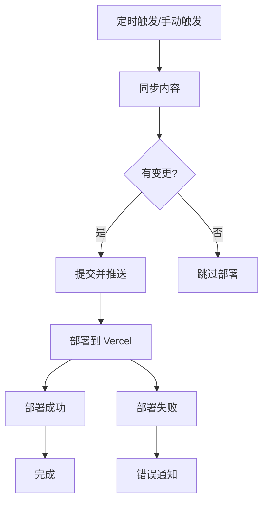

# GitHub Actions 自动同步与部署工作流

本目录包含了用于自动同步 `ruanyf/weekly` 仓库内容并自动部署到 Vercel 的完整工作流配置。

## 🚀 功能概述

### 自动同步工作流 (`sync-weekly.yml`)

- **触发方式**: 每天凌晨2点（北京时间）自动执行，也支持手动触发
- **同步内容**: `docs/` 目录和 `README.md` 文件
- **同步策略**: 使用 rsync 进行增量同步
- **自动部署**: 内容同步完成后自动触发 Vercel 生产环境部署

## 📋 工作流程

## ⚙️ 配置说明

### 环境变量

- `SOURCE_REPO`: 源仓库名称（默认: `ruanyf/weekly`）
- `TARGET_BRANCH`: 目标分支名称（默认: `nextjs`）
- `GITHUB_TOKEN`: GitHub API 令牌（自动提供）

### Vercel 配置

需要在 GitHub Secrets 中配置以下变量：

| Secret 名称 | 描述 | 获取方式 |
|------------|------|----------|
| `VERCEL_TOKEN` | Vercel API Token | Vercel Dashboard → Settings → Tokens |
| `VERCEL_ORG_ID` | Vercel 组织 ID | Vercel Dashboard → Settings → General |
| `VERCEL_PROJECT_ID` | Vercel 项目 ID | 项目 Settings → General |

## 🚀 快速开始

### 1. 配置 Vercel

1. 登录 [Vercel Dashboard](https://vercel.com/dashboard)
2. 获取 Vercel Token、Organization ID 和 Project ID
3. 在 GitHub 仓库 Settings → Secrets and variables → Actions 中添加上述三个 secrets

### 2. 测试部署

1. 访问 GitHub Actions 页面
2. 选择 "自动同步周刊内容" 工作流
3. 点击 "Run workflow" 按钮进行手动测试

## 🔧 故障排除

### 常见问题

1. **同步失败**: 查看工作流日志获取详细错误信息
2. **权限问题**: 确认 GitHub Token 有足够权限
3. **部署失败**: 检查 Vercel Token 和项目 ID 是否正确
4. **构建失败**: 检查 `package.json` 中的构建脚本

### 调试步骤

1. **查看工作流日志**: GitHub Actions 页面 → 失败的工作流 → 详细日志
2. **检查 Vercel 部署**: Vercel Dashboard → 部署历史 → 具体部署日志
3. **本地测试**: `npm run build && vercel --prod`

## 📊 监控和状态

### 部署状态监控

- GitHub Actions 会显示工作流执行状态
- Vercel Dashboard 会显示部署状态
- 工作流包含成功/失败通知

### 建议的监控设置

1. **GitHub 通知**: 在仓库设置中启用 Actions 通知
2. **Vercel 通知**: 在 Vercel 项目设置中配置部署通知
